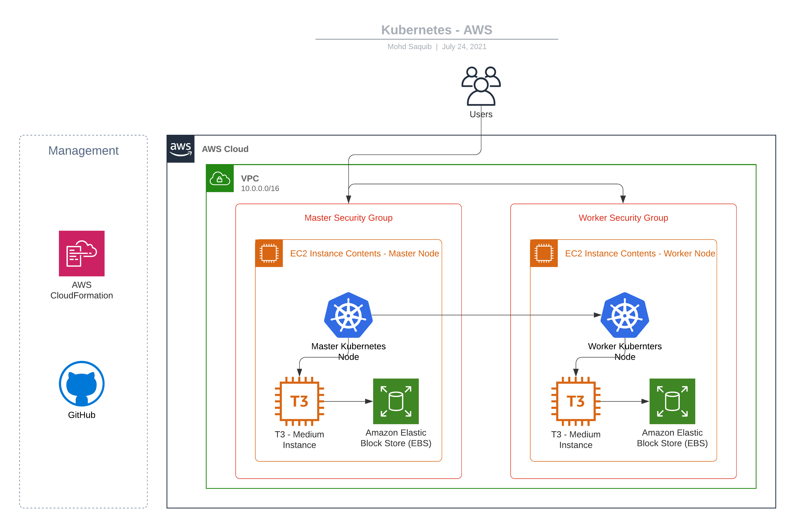

# Install Kubernetes on AWS Ubuntu
Deploy a Kubernetes Cluster under 5 mins!

## Architecture


## Resources Created by this Template
- Worker Node EC2 [WrokerNode]
- Master Node EC2 [MasterNode]
- Master Security Group [KuberentesSGMasterNode]
- Worker Secuirty Group [KuberentesSGWorkerNode]

## Template Flow
1. Cloudformation Creates 2 Secuirty Groups for each of the nodes
2. After the Security Groups have been created, 2 EC2 Instances are initiated with 1 being Master and the other being Worker
3. As soon as the EC2 Instances run, it downloads this github repo and changes the permissions of the bash script files to executable

## File Tree Structure
```bash
.
├── README.md
├── docs
│   ├── Kubernetes - AWS.pdf
│   └── Kubernetes_aws.png
├── install_components.sh
├── kube_init.sh
├── kubernetes_dashboard.sh
├── parameters.txt
└── template.yaml

1 directory, 8 files
```

## Management
All resources are built and tested using [AWS CloudFormation](https://docs.aws.amazon.com/AWSCloudFormation/latest/UserGuide/Welcome.html) and stored in [Github](https://github.com/github-ragil/aws-kubernetes.git).

## How to use?
### Pre-requisites
- AWS Account
- Basic AWS Knowledge
- Kubernetes Knowledge
- Familiar with AWS Cloudformation

### How to Install this template
Download this repo to your local machine or clone the repo

#### AWS 
1. Go to AWS, and search for Cloudformation
2. In Cloudformation, click on "Create Stack" on the top right corner of the screen
3. Select "With new resources (standard)
4. Under the "Create Stack", select "Upload a template file"
5. Click on "Choose file" button and select the template.yaml from the downloaded code, then click on "Next"
6. Provide a valid "Stack Name". NOTE: CAN BE ANYTHING AS LONG AS IT MEETS THE CRITERIA
7. Enter a valid ImageAMIId. DEFAULT: ami-04ff9e9b51c1f62ca (Ubuntu 20.04)
8. Select the InstanceType. DEFAULT: t3.small
9. Enter the desired volume size for the EC2s. DEFAULT 20 GB
10. Click on "Next"
11. Click on "Next" under "Configure stack options"
12. Click on "Next" under "Review [TEMPLATE_NAME]"

####

Build a serverless application and prepare if for cloudformation
in master node check join command
```bash
cat /home/ubuntu/token.txt
```